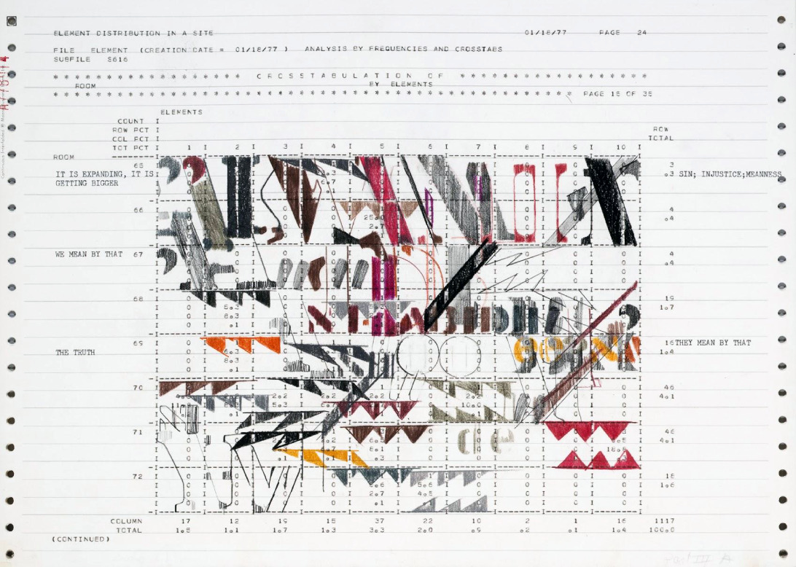
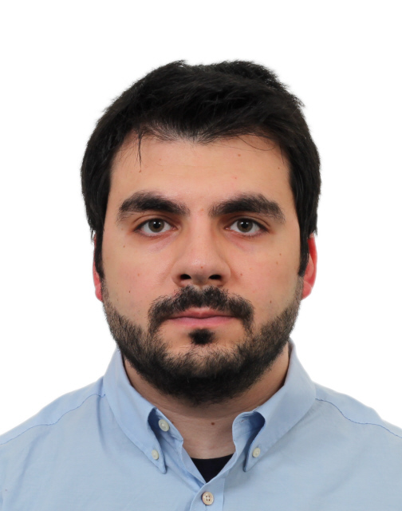
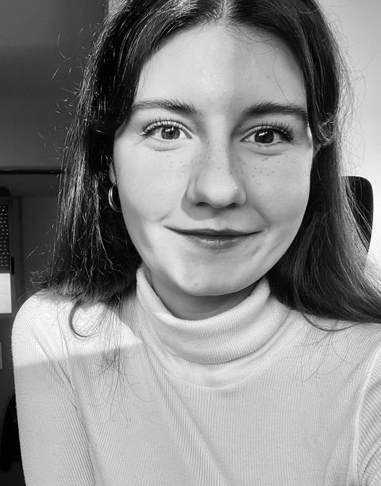

# Welcome! {.unnumbered}

<fig>
</img>
<figcaption> From: Sonya Rapoport, Anasazi Series, (pencil, prismacolor, colored typewriter, and computer print on continuous-feed computer paper; 2 folios, 15 and 14 pages each), 1977 [ref: Leslie Jones, CODED: Art at the Dawn of the Computer Age, 1960-1980, Los Angeles County Museum of Art, Los Angeles, CA, Fall 2021] </figcaption>
</fig>

Welcome to the Cultural Data Exploration Toolkit! Throughout this workshop, you'll explore the nuances of data-driven analysis, from constructing your dataset and formulating research inquiries to learning data visualisation techniques. Along this journey, you'll contemplate the creation of personalised data models tailored to your research queries, navigate potential biases within datasets, and, importantly, learn how to effectively interrogate, explore, and analyse gathered information to generate visualisations.

# Your Trainers

---

```{=html}
<div style="display: flex; align-items: center; max-width: 750px; font-family: Arial, sans-serif;">

  <div style="flex-shrink: 0; width: 180px; height: 180px; border-radius: 50%; overflow: hidden;">
    
  </div>

  <div style="margin-left: 20px;">
    <h3 style="margin: 0;"><strong>Chiara Livio</strong></h3>
    <p style="margin: 4px 0;">Open Access Advisor – Publishing Support, Utrecht University Library</p>
    <p style=="padding-right: 1cm;"><em>Chiara is an information specialist focusing on Open Access publishing particularly scholarly books and academic-led journals (Diamond Open Access). Prior to her current position, she obtained a PhD in Sanskrit philology from Sapienza University of Rome (2020) and was a postdoc at the University of Bologna---where she worked at the intersection of Sanskrit and Digital Humanities---and at the International Institute for Asian Studies in Leiden.</em></p>
  </div>

</div>
```

---

```{=html}
<div style="display: flex; align-items: center; max-width: 750px; font-family: Arial, sans-serif;">

  <div style="margin-right: 20px;">
    <h3 style="margin: 0;"><strong>Stefano Rapisarda</strong></h3>
    <p style="margin: 4px 0;">Research Data & Software Consultant – Research Support, Utrecht University Library</p>
    <p style=="padding-right: 2cm;"><em>
        Stefano is a research data & software consultant focusing on making research data and software FAIR. His background is Astrophysics, he got his PhD at the University of Amsterdam and worked in reasearch until the beginning of his current appointment (2023). Besides astrophysics, he is interested in teaching, programming, AI, natural language processing, and all the natural sciences.
    </em></p>
  </div>

  <div style="flex-shrink: 0; width: 180px; height: 180px; border-radius: 50%; overflow: hidden;">
    
  </div>

</div>
```

---

```{=html}
<div style="display: flex; align-items: center; max-width: 750px; font-family: Arial, sans-serif;">

  <div style="flex-shrink: 0; width: 180px; height: 180px; border-radius: 50%; overflow: hidden;">
    
  </div>

  <div style="margin-left: 20px;">
    <h3 style="margin: 0;"><strong>Bárbara Romero Ferrón</strong></h3>
    <p style="margin: 4px 0;">Research Associate at Leuphana University and Senior Researcher at iArtHisLab, University of Málaga</p>
    <p style=="padding-right: 1cm;"><em>Bárbara Romero Ferrón is a Research Associate at Leuphana University and Senior Researcher at iArtHisLab, University of Málaga. Previously, she worked as a Digital Humanities Specialist at Utrecht University Library, where she promoted this workshop. She holds a PhD from Western University. Her research focuses on knowledge graphs, network analysis, and exhibition studies. Since 2019, she has taught computational methods in art history.</em></p>
  </div>

</div>
```

---